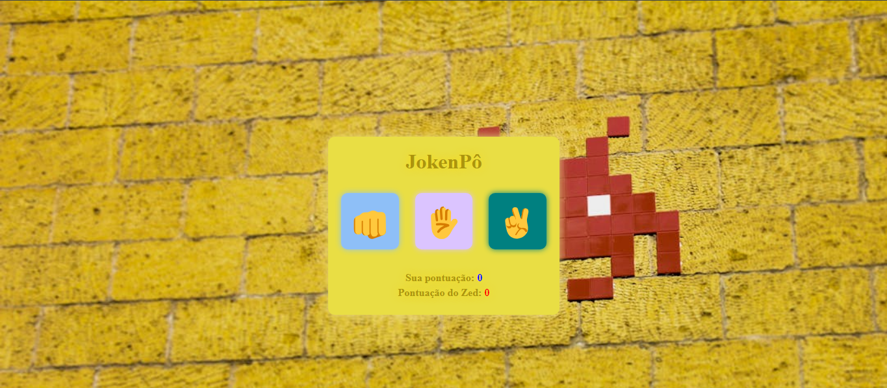

<h1>JokenPô</h1>

Projeto do jogo pedra, papel e tesoura desenvolvido como exercicio do curso DevClub, com designer leve e com uma pegada classica adicionei sons para a experiência do usuário ficar bem divertida na jogatina, deixei responsivo para as jogatinas também em mobile. 

<b>
Ferramentas utilizadas:

 
 

<b>
Ao som de:

